# Footprints

<!-- START doctoc generated TOC please keep comment here to allow auto update -->
<!-- DON'T EDIT THIS SECTION, INSTEAD RE-RUN doctoc TO UPDATE -->

- [Push_Button](#push_button)
- [Si7021](#si7021)
- [wemos_d1_mini](#wemos_d1_mini)
- [wemos_battery_shield](#wemos_battery_shield)
- [VEML6075_breakout_board](#veml6075_breakout_board)
- [nRF52 Bluefruit Feather Adafruit breakout board](#nrf52-bluefruit-feather-adafruit-breakout-board)
- [CREE RGB LED 5.5mm x 5.5mm 6pin](#cree-rgb-led-55mm-x-55mm-6pin)
- [Connector USB Micro-B Horizontal](#connector-usb-micro-b-horizontal)
- [Battery holder for 3xAA Takachi](#battery-holder-for-3xaa-takachi)
- [Passives 0805](#passives-0805)
- [GPS CDTop MT3333 PA1010D](#gps-cdtop-mt3333-pa1010d)
- [Panelization](#panelization)

<!-- END doctoc generated TOC please keep comment here to allow auto update -->

## Push_Button

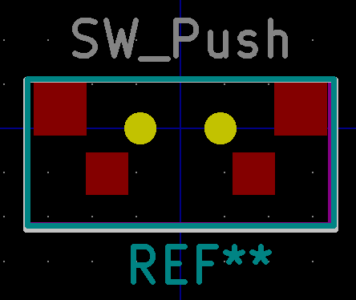

## Si7021

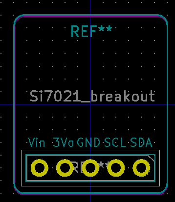

## wemos_d1_mini

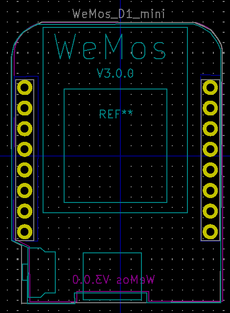

## wemos_battery_shield

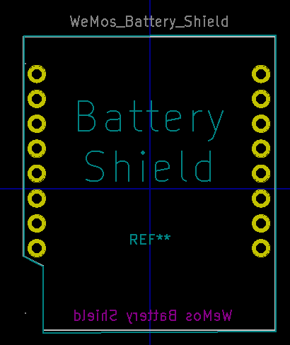

## VEML6075_breakout_board

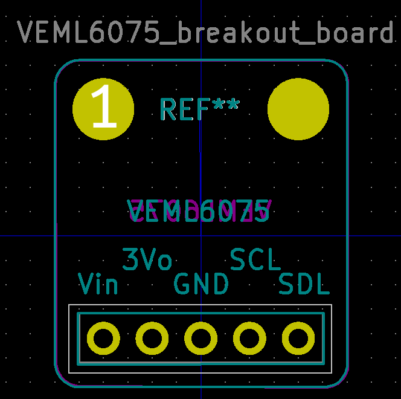

## nRF52 Bluefruit Feather Adafruit breakout board

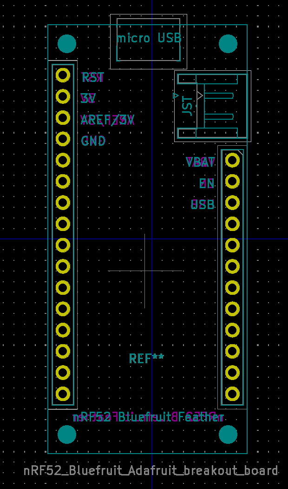

## CREE RGB LED 5.5mm x 5.5mm 6pin

## Connector USB Micro-B Horizontal

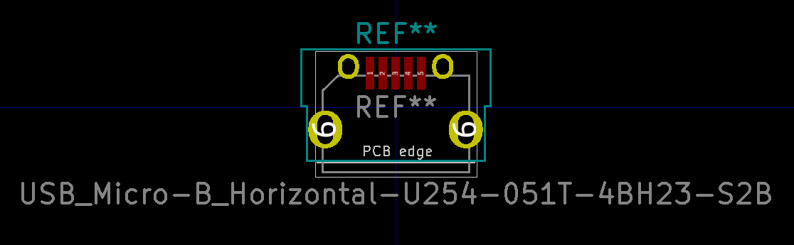

## Battery holder for 3xAA Takachi

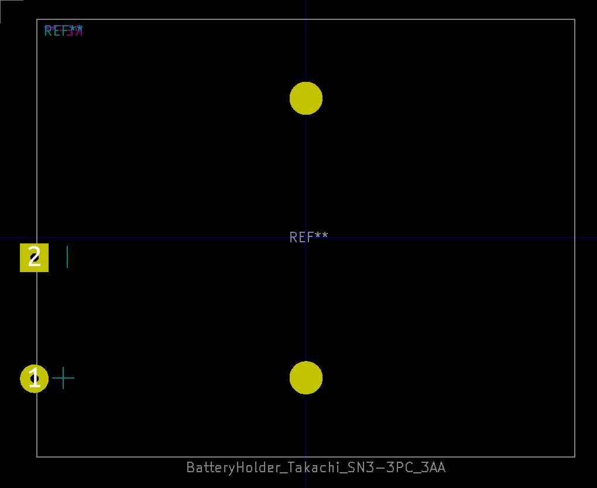

## Passives 0805

Capacitor

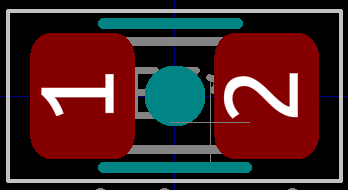

Diode

LED

Inductor

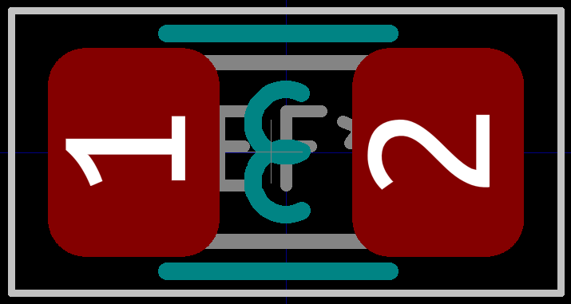

Resistor

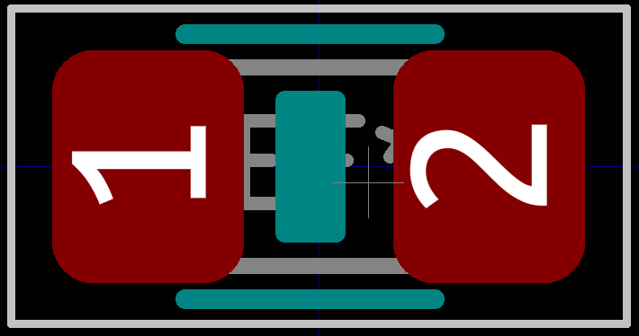

## GPS CDTop MT3333 PA1010D

## Panelization

With tabs and mouse bites.

Credits: [Panelization by madworm](https://github.com/madworm/Panelization.pretty)

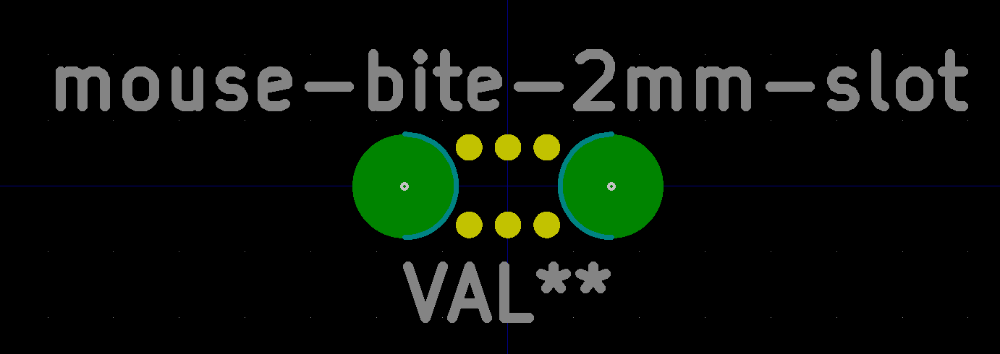
