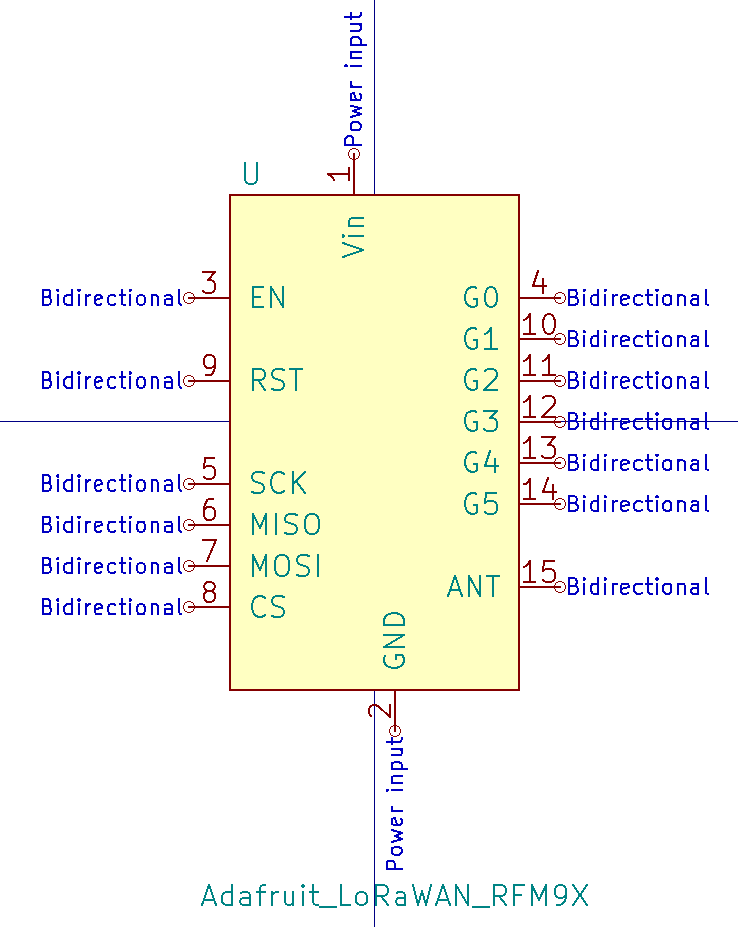
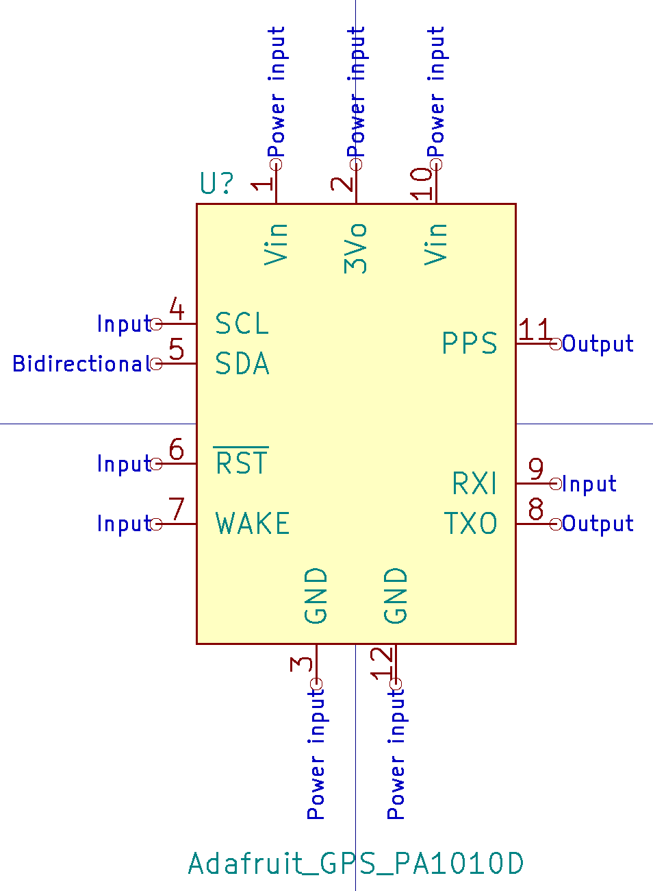
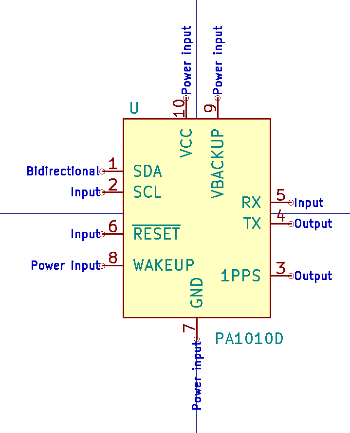
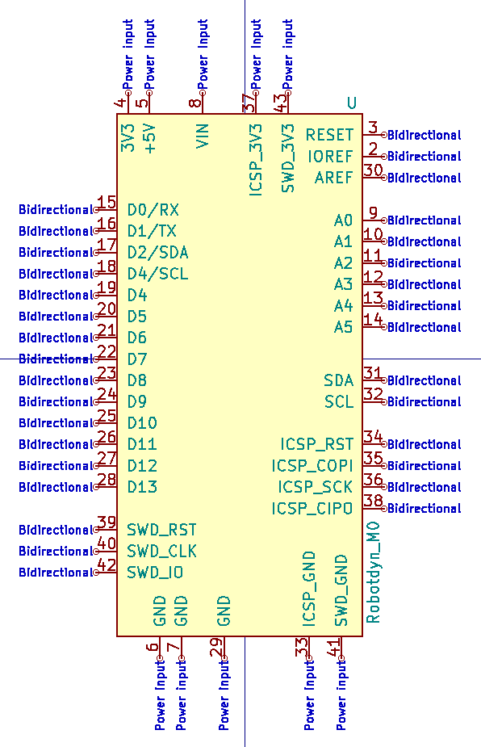
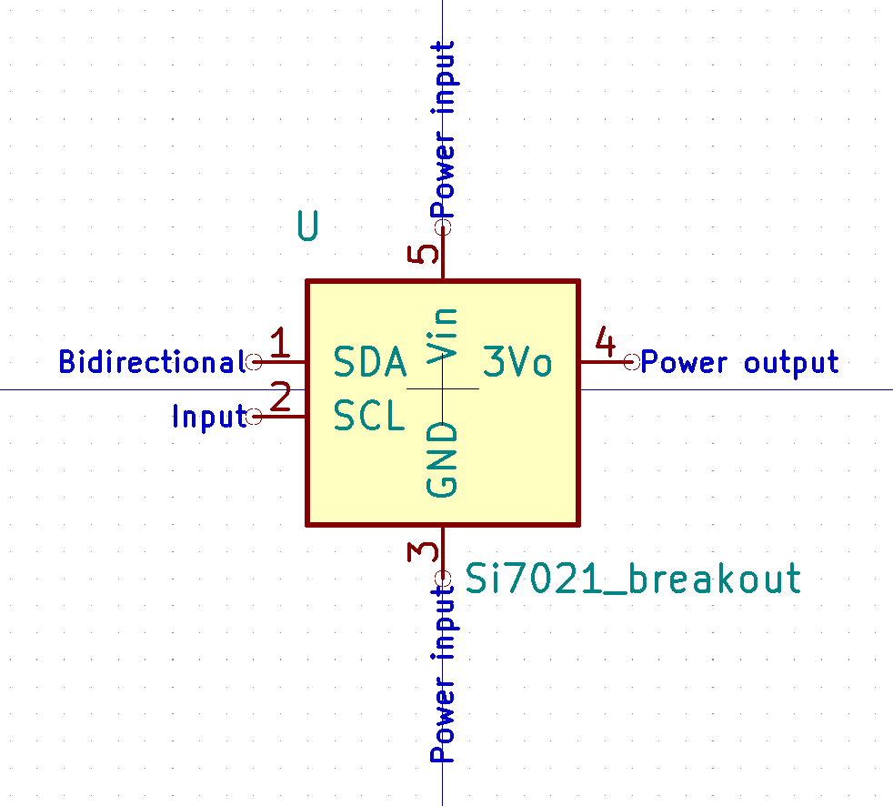
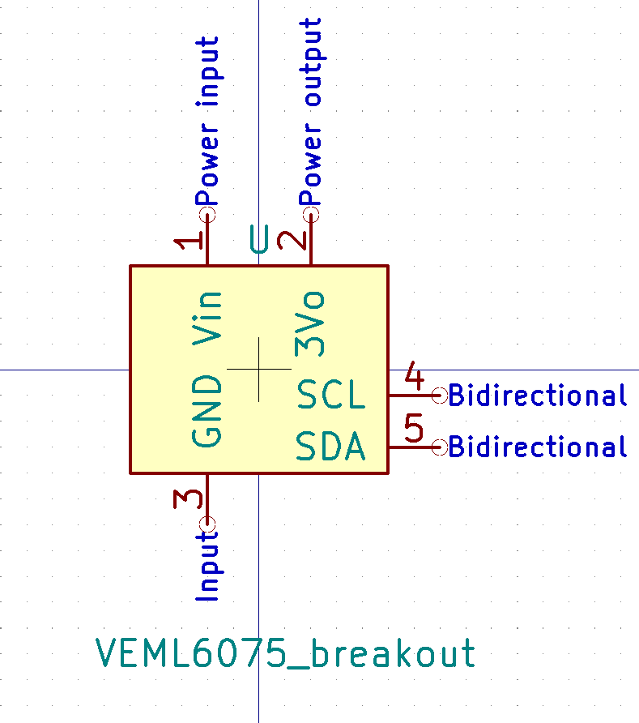
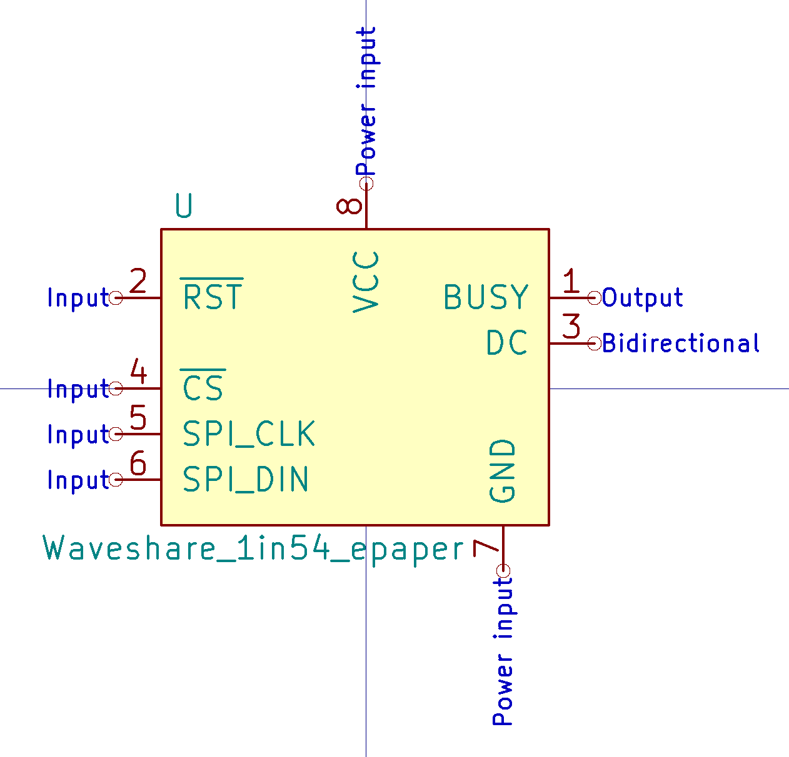
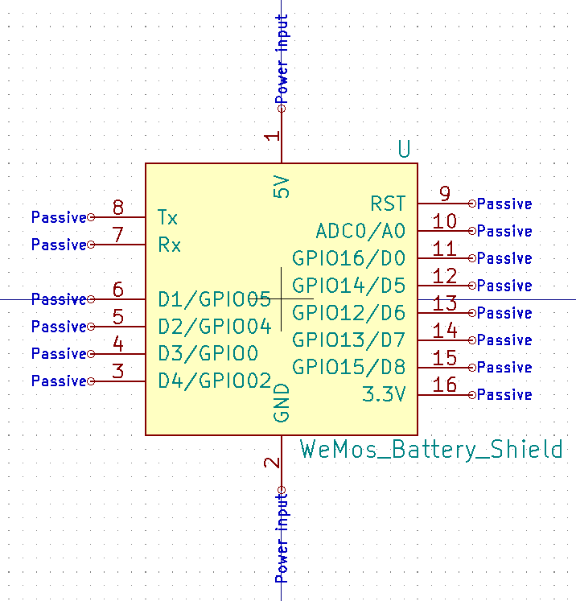
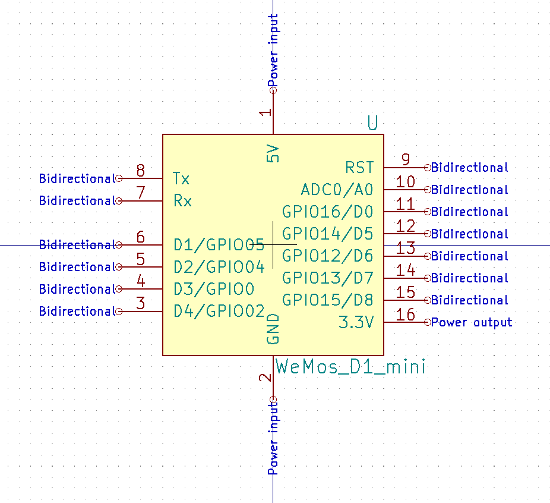

<!-- START doctoc generated TOC please keep comment here to allow auto update -->
<!-- DON'T EDIT THIS SECTION, INSTEAD RE-RUN doctoc TO UPDATE -->
**Table of Contents**

- [Adafruit RFM9x LoRaWAN](#adafruit-rfm9x-lorawan)
- [Adafruit nRF52 feather](#adafruit-nrf52-feather)
- [Adafruit PA1010D GPS](#adafruit-pa1010d-gps)
- [Adafruit sharp display](#adafruit-sharp-display)
- [CDTop PA1010D GPS](#cdtop-pa1010d-gps)
- [Robotdyn SAMD21 M0 mini](#robotdyn-samd21-m0-mini)
- [SiLabs CP2102 USB to UART bridge](#silabs-cp2102-usb-to-uart-bridge)
- [SiLabs Si7021 breakout board](#silabs-si7021-breakout-board)
- [Vishay VEML6075 UV sensor](#vishay-veml6075-uv-sensor)
- [Waveshare E-paper 1.54inch](#waveshare-e-paper-154inch)
- [WeMos ESP8266 battery shield](#wemos-esp8266-battery-shield)
- [WeMos D1 mini](#wemos-d1-mini)

<!-- END doctoc generated TOC please keep comment here to allow auto update -->

## Adafruit RFM9x LoRaWAN

## Adafruit nRF52 feather

## Adafruit PA1010D GPS

## Adafruit sharp display

## CDTop PA1010D GPS

## Robotdyn SAMD21 M0 mini

## SiLabs CP2102 USB to UART bridge

## SiLabs Si7021 breakout board

## Vishay VEML6075 UV sensor

## Waveshare E-paper 1.54inch

## WeMos ESP8266 battery shield

## WeMos D1 mini

